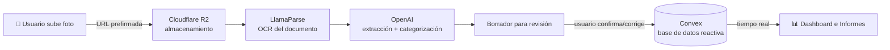

<div align="center">

# 🧾 Tikea

### Inteligencia para tus tickets y facturas del día a día

Fotografía un ticket y deja que la IA extraiga el monto, la fecha, el comercio y la categoría.
Visualiza todo tu gasto en un dashboard claro y expórtalo para tu contador.


</div>

---

## ✨ ¿Qué es Tikea?

**Tikea** es una aplicación SaaS que convierte la foto de un ticket o factura en **datos estructurados** automáticamente. En lugar de capturar tus gastos a mano, subes una imagen y un pipeline de IA lee el documento, extrae los campos clave y los categoriza. Después puedes revisar, corregir, analizar y exportar todo desde un dashboard.

Pensado para quien lleva sus gastos del día a día (freelancers, pequeños negocios, uso personal) y quiere dejar de teclear recibos.

> 💡 Proyecto full-stack construido de punta a punta con **desarrollo asistido por IA** (Claude Code), tomando las decisiones de arquitectura y entendiendo el sistema completo.

---

## 🎯 Características

- 📸 **Captura por foto** — sube la imagen del ticket; el resto es automático.
- 🤖 **Extracción con IA** — OCR + modelo de lenguaje que detecta **comercio, fecha, total, impuesto, método de pago y categoría**.
- ✅ **Revisión humana** — antes de guardar, revisas y corriges lo que la IA extrajo (human-in-the-loop).
- 📊 **Dashboard** — KPIs del mes, gráfica de dona por categoría, tendencia mensual y tickets recientes.
- 📈 **Informes analíticos** — filtros por periodo / categoría / comercio, comparativa mes a mes, desglose por categoría y **exportación CSV / PDF**.
- 🗂️ **Gestor de tickets** — búsqueda, filtros, vista tabla/galería, edición y borrado.
- 🔐 **Autenticación** — Google OAuth y correo/contraseña.
- 💳 **Suscripciones** — plan **Free** (hasta 10 tickets/mes) y **Pro** con Stripe (Checkout + webhooks).
- 🌎 **Multi-moneda** — MXN, USD, EUR, GBP con formato localizado.

---

## ⚙️ Cómo funciona (el pipeline de IA)

El corazón de Tikea es el flujo que convierte una imagen en datos:



1. **Subida directa a R2** — el navegador sube la imagen a Cloudflare R2 mediante una **URL prefirmada** (la clave se prefija con el `userId`, aislando los archivos por usuario).
2. **OCR con LlamaParse** — el documento se convierte a texto.
3. **Extracción con OpenAI** — un modelo estructura el texto en campos (comercio, fecha, total, impuesto, método) y asigna una **categoría**.
4. **Revisión** — se genera un borrador que el usuario confirma o corrige.
5. **Persistencia reactiva** — al confirmar, el ticket se guarda en **Convex**; el dashboard y los informes se actualizan **en tiempo real** sin recargar.

---

## 🧱 Stack tecnológico

| Capa | Tecnología | Rol |
|---|---|---|
| **Framework** | Next.js 16 (App Router) + React 19 | Frontend + rutas + Server Components |
| **Backend + BD** | [Convex](https://convex.dev) | Base de datos reactiva, funciones serverless, tiempo real |
| **Autenticación** | [Better Auth](https://better-auth.com) (sobre Convex) | Google OAuth + email/password |
| **Almacenamiento** | [Cloudflare R2](https://developers.cloudflare.com/r2/) | Imágenes de tickets (URLs prefirmadas) |
| **OCR** | [LlamaParse](https://cloud.llamaindex.ai) | Lectura del documento |
| **IA** | [OpenAI API](https://platform.openai.com) | Extracción y categorización de datos |
| **Pagos** | [Stripe](https://stripe.com) | Suscripciones (Checkout + webhooks) |
| **UI** | shadcn/ui + Tailwind CSS v4 | Componentes y estilos |
| **Hosting** | Netlify | Despliegue del frontend |

---

## 📁 Estructura del proyecto

```
.
├── convex/                 # Backend: BD, funciones y lógica de servidor
│   ├── schema.ts           # Esquema de la base de datos (tickets, usuarios…)
│   ├── tickets.ts          # CRUD de tickets (queries/mutations)
│   ├── extraction.ts       # Pipeline OCR (LlamaParse) + IA (OpenAI)
│   ├── files.ts            # Subida a R2 con URLs prefirmadas
│   ├── auth.ts             # Better Auth corriendo sobre Convex
│   ├── stripe.ts           # Checkout y webhooks de Stripe
│   └── subscriptions.ts    # Lógica de planes Free/Pro
└── src/
    ├── app/                # Rutas (App Router)
    │   ├── page.tsx        # Landing
    │   ├── login, registro # Auth
    │   └── app/            # Dashboard protegido (panel, tickets, informes, ajustes)
    ├── components/
    │   ├── landing/        # Secciones de la landing
    │   ├── app/            # UI del dashboard (KPIs, gráficas, tablas…)
    │   └── ui/             # Primitivas shadcn/ui
    └── lib/                # Hooks, tipos y helpers (Convex, formato, export…)
```

---

## 🚀 Cómo correrlo localmente

### Requisitos
- Node.js 18.14+ (recomendado 20+)
- Cuentas/keys de: Convex, Cloudflare R2, LlamaParse, OpenAI, Stripe y Google OAuth

### Pasos

```bash
# 1. Instalar dependencias
npm install

# 2. Levantar el backend de Convex (crea/conecta el deployment)
npx convex dev

# 3. En otra terminal, levantar el frontend
npm run dev
```

Abre [http://localhost:3000](http://localhost:3000).

### Variables de entorno

**Frontend** — `.env.local` (en la raíz):

```bash
NEXT_PUBLIC_CONVEX_URL=        # URL del deployment de Convex
NEXT_PUBLIC_CONVEX_SITE_URL=   # URL .site del deployment (para auth)
```

**Backend** — se configuran en el deployment de Convex con `npx convex env set <VAR> <valor>`:

```bash
SITE_URL                # URL pública del frontend (http://localhost:3000 en local)
GOOGLE_CLIENT_ID        # Google OAuth
GOOGLE_CLIENT_SECRET
LLAMA_CLOUD_API_KEY     # LlamaParse (OCR)
OPENAI_API_KEY          # OpenAI (extracción)
OPENAI_MODEL            # opcional (modelo a usar)
STRIPE_SECRET_KEY       # Stripe
STRIPE_PRICE_PRO        # ID del precio del plan Pro
STRIPE_WEBHOOK_SECRET   # secreto de firma del webhook (whsec_…)
R2_BUCKET               # Cloudflare R2
R2_ENDPOINT
R2_ACCESS_KEY_ID
R2_SECRET_ACCESS_KEY
R2_TOKEN
```

> 🔒 Ningún secreto está versionado: los archivos `.env*` están en `.gitignore`.

---

## ☁️ Despliegue

- **Frontend** → Netlify (`netlify deploy --prod`).
- **Backend** → Convex (`npx convex deploy`), que crea/usa el deployment de producción.
- Configura las variables de entorno de producción en cada plataforma y apunta el **webhook de Stripe** a la URL pública del backend.

---

## 📝 Nota

Tikea es un proyecto personal/portafolio. El stack está elegido para ser **100% serverless y de bajo costo**, apoyándose en tiers gratuitos (Convex, R2, Netlify) y pagando solo por el uso de IA.

<div align="center">

Hecho con ☕ por [Christopher Moreno](https://github.com/christoqpher)

</div>
